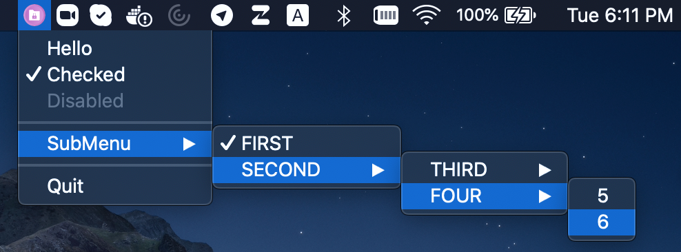
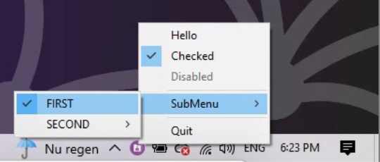

# Overview

[](https://github.com/LizardByte/tray/actions/workflows/ci.yml?query=branch%3Amaster)
[](https://codecov.io/gh/LizardByte/tray)
[](https://github.com/LizardByte/tray)

## About

Cross-platform, super tiny C99 implementation of a system tray icon with a popup menu and notifications.

The code is C++ friendly and will compile fine in C++98 and up. This is a fork of
[dmikushin/tray](https://github.com/dmikushin/tray) and is intended to add additional features required for our own
[Sunshine](https://github.com/LizardByte/Sunshine) project.

This fork adds the following features:

- system tray notifications
- support for both linux appindicator versions
- unit tests
- code coverage
- refactored code, e.g. moved source code into the `src` directory
- doxygen documentation, and readthedocs configuration

## Screenshots

<div class="tabbed">

- <b class="tab-title">Linux</b>
- <b class="tab-title">macOS</b>
- <b class="tab-title">Windows</b>

</div>

## Supported platforms

* Linux/Gtk (libayatana-appindicator3 or libappindicator3)
* Windows XP or newer (shellapi.h)
* MacOS (Cocoa/AppKit)

## Prerequisites

* CMake
* [Ninja](https://ninja-build.org/), in order to have the same build commands on all platforms 

### Linux Dependencies

<div class="tabbed">

- <b class="tab-title">Arch</b>
    ```bash
    sudo pacman -S libayatana-appindicator
    ```

- <b class="tab-title">Debian/Ubuntu</b>
    ```bash
    sudo apt install libappindicator3-dev
    ```

- <b class="tab-title">Fedora</b>
    ```bash
    sudo dnf install libappindicator-gtk3-devel
    ```

</div>

## Building

```bash
mkdir -p build
cmake -G Ninja -B build -S .
ninja -C build
```

## Demo

Execute the `tray_example` application:

```bash
./build/tray_example
```

## Tests

Execute the `tests` application:

```bash
./build/tests/test_tray
```

## API

Tray structure defines an icon and a menu.
Menu is a NULL-terminated array of items.
Menu item defines menu text, menu checked and disabled (grayed) flags and a
callback with some optional context pointer.

```c
struct tray {
  char *icon;
  struct tray_menu *menu;
};

struct tray_menu {
  char *text;
  int disabled;
  int checked;

  void (*cb)(struct tray_menu *);
  void *context;

  struct tray_menu *submenu;
};
```

* `int tray_init(struct tray *)` - creates tray icon. Returns -1 if tray icon/menu can't be created.
* `void tray_update(struct tray *)` - updates tray icon and menu.
* `int tray_loop(int blocking)` - runs one iteration of the UI loop. Returns -1 if `tray_exit()` has been called.
* `void tray_exit()` - terminates UI loop.

All functions are meant to be called from the UI thread only.

Menu arrays must be terminated with a NULL item, e.g. the last item in the
array must have text field set to NULL.

## License

This software is distributed under [MIT license](http://www.opensource.org/licenses/mit-license.php),
so feel free to integrate it in your commercial products.

<details style="display: none;">
  <summary></summary>
  [TOC]
</details>
